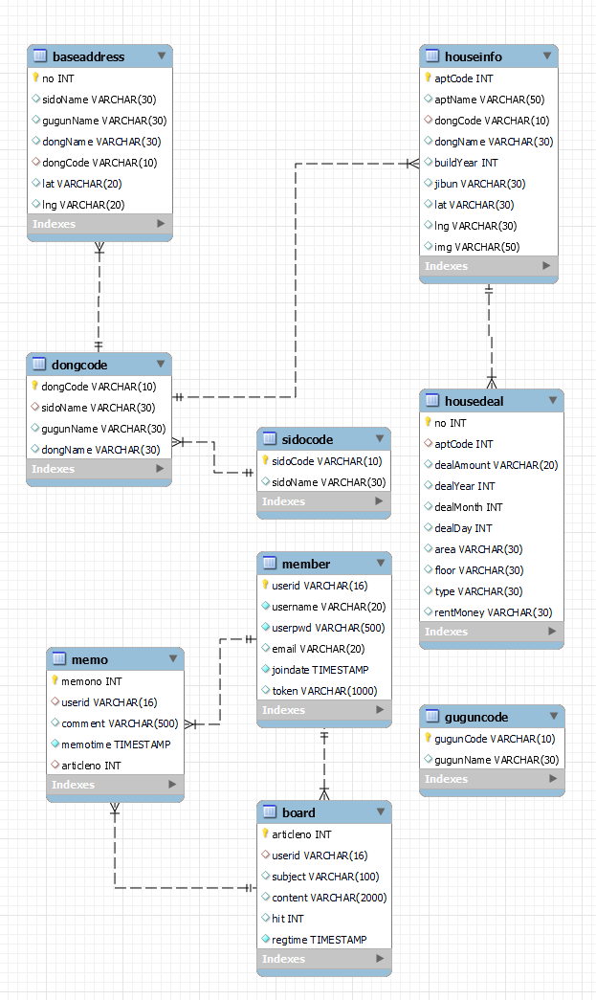
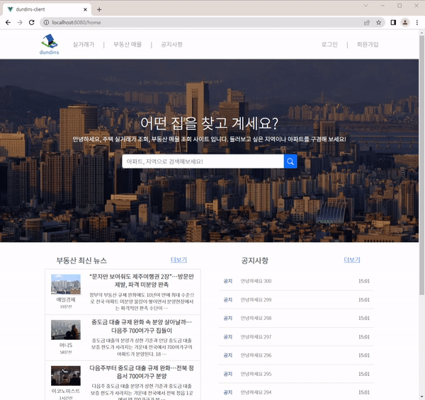
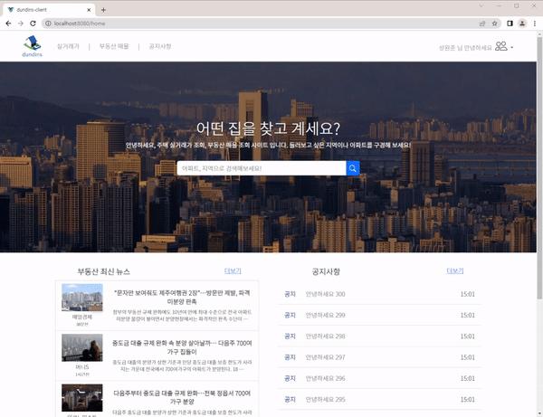
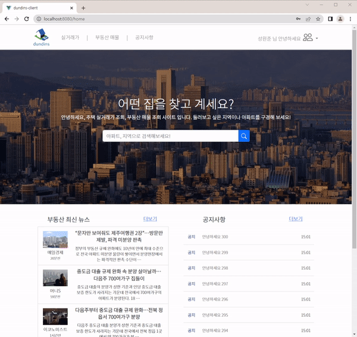
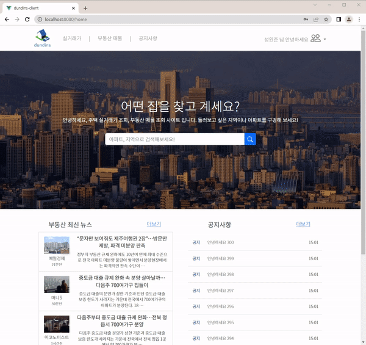
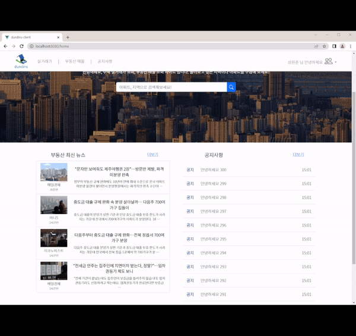

# Project Happy House

😲본 프로젝트는 **삼성 청년 SW 아카데미** 1학기 관통 프로젝트 결과물입니다

  

## **개요**

- 국토교통부에서 제공하는 아파트, 다가구 등 주택에 대한 실거래가 조회 서비스를 활용한 웹 사이트

- 부동산 매물의 다양한 서비스 제공을 목적으로 매물 실거래가, 최신 매물 정보 등을 제공

  

## 프로젝트 기간

- 2022년 11월 16일 ~ 2022년 11월 24일

 

 

## 기술 스택

   
   
   
   
   
   
   
  

######   

## 팀원

<table>
  <thead>
    <tr>
      <th>이름</th>
      <th>역할</th>
      <th>구현 기능</th>
    </tr>
  </thead>
  <tbody>
    <tr>
      <td rowspan="2">성원준</td>
      <td rowspan="2">팀원</td>
      <td>Front-End, Back-End</td>
    </tr>
    <tr>
      <td>Back-End (Rest API 설계, SQL/Spring 디버깅, 이미지 업로드, 매물 조회 게시판 카테고리/키워드 검색 등 필요 API 추가, DB 테이블 수정 등)</td>
    </tr>
    <tr>
      <td rowspan="2">강은진</td>
      <td rowspan="2">팀장</td>
      <td>Front-End, Back-End</td>
    </tr>
    <tr>
      <td>Front-End (메인 페이지 검색창 수정 및 매물 조회 게시판 디자인)</td>
    </tr>
  </tbody>
</table>

  

## **DataBase 설계**

  

## 주요 기능

  

## 실행 화면

### 🔗 메인 페이지 - 뉴스 API

- 메인 페이지에서는 네이버 실시간 부동산 뉴스를 볼 수 있고 상세 주소로 이동이 가능합니다.
  

### 🔗 메인 페이지 - 키워드 검색

- 메인 페이지의 검색바를 통해 바로 매물 검색을 할 수 있습니다.

  

---

### 🔗 회원가입

- 회원가입을 하는 부분입니다.
  

### **🔗 마이페이지**

- 마이페이지에서 회원 상세 정보 및 회원 정보 수정이 가능합니다.
  

---

### 🔗 공지사항

- 공지사항을 통해 안내문을 확인할 수 있습니다.
  

---

### **🔗 매물 검색 - 동 검색**

- 매물 페이지에서 좌측 상단의 버튼을 통해 원하는 지역의 매물을 확인할 수 있습니다.
  

### **🔗 매물 검색 - 키워드 검색**

- 검색바에서 지역 키워드를 사용하여 검색할 수도 있습니다.
  

### **🔗 상세 조회**

- 매물은 가격 정보, 평수를 나타내며 클릭할 시 상세 정보를 확인할 수 있습니다.
  

### **🔗 매물 등록**

- 매물 조회 페이지에서는 사용자가 직접 등록한 글을 볼 수 있고 등록할 수 있습니다.
  

